# Configurando Mongo DB Atlas

### Passo 1
Acesse o site oficial do [MongoDB Atlas](https://www.mongodb.com/products/platform/atlas-database), clique em **"Get started"**.  

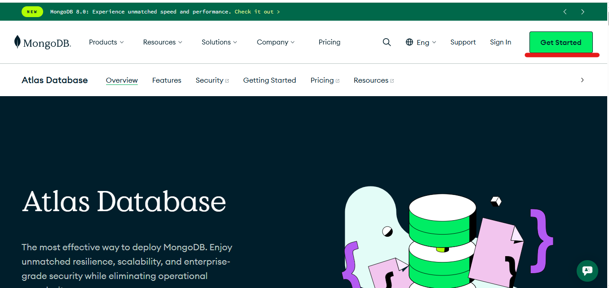

---
### Passo 2   
Cadastre-se. Eu prefiro usar o autenticador do Goggle pra me cadastrar, achomais pratico e mais rapido.  
Mas você pode optar por preencher seru dados normalmente.  

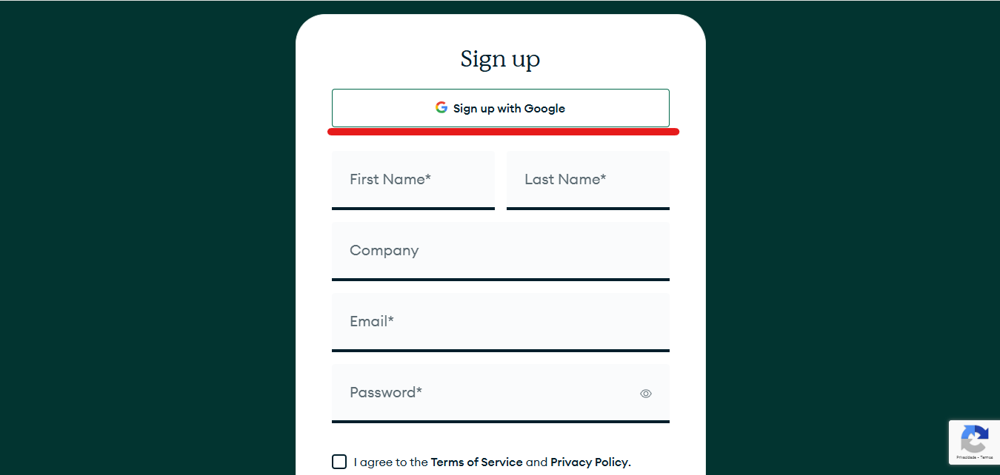 

---
### Passo 3
Leia e concorde com os termos de uso, e depois clique em **"Submit"** .  

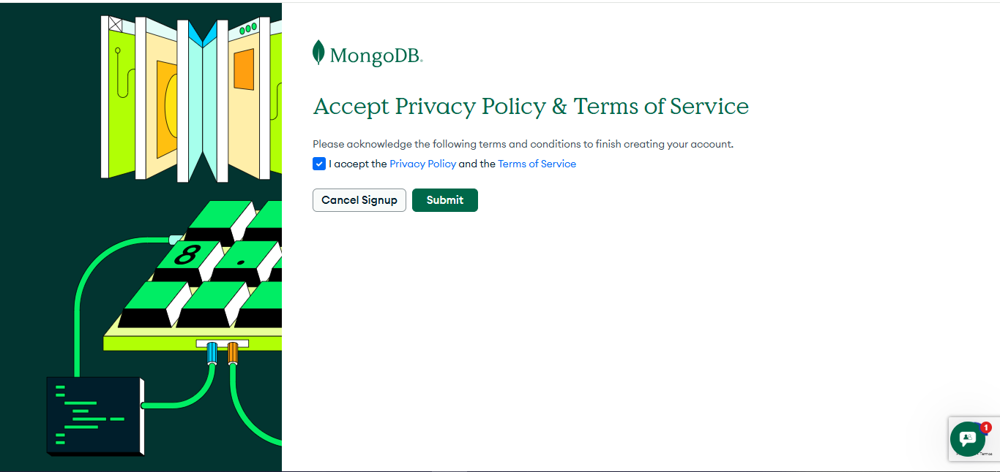 

---
### Passo 4 
O MongoDB gostará de saber os motivos de você usá-lo  
Escolha as opções que melhor descrevem seu perfil de uso e clique no botão **"Finish"**. Ou você pode apenas pular essa etapa.  

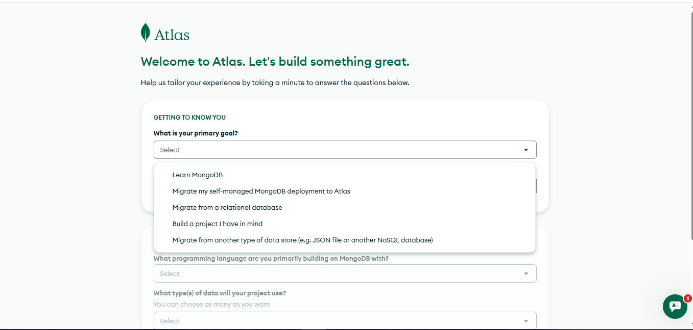  
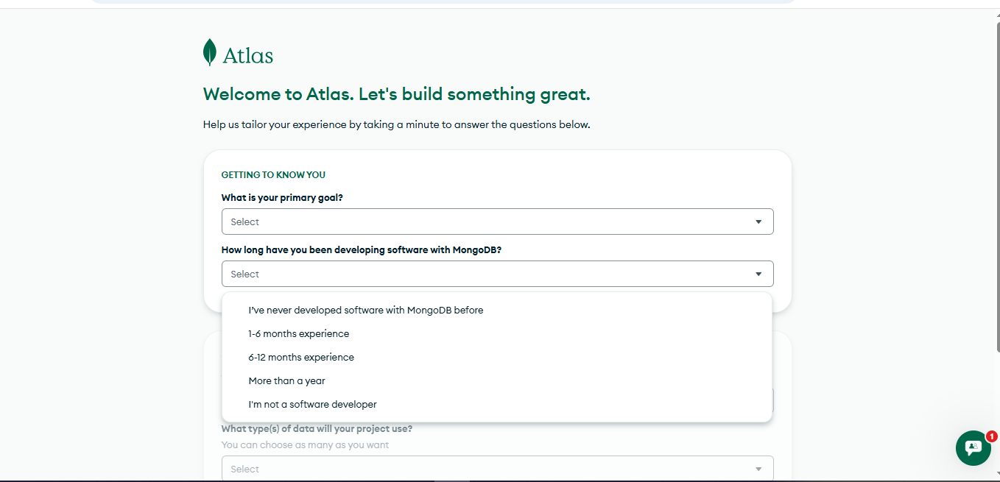  
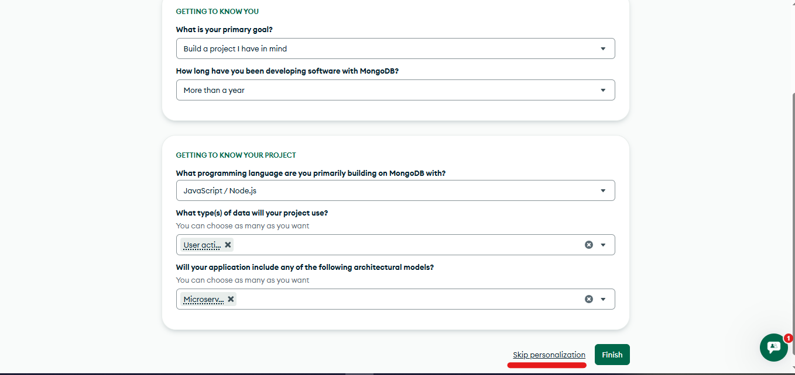   

---
### Passo 5 
Você tem a opção de comecar com 512 Mb de aramazenamento, o que é muito mais do que suficiente para este projeto.  
Mantenha **"Automate security setup"** e **"Preload sample dataset"** selecionados, para que o MongoDB adicione o endereço IP do dispositivo que está usando para se cadastrar, salvo como "confiavel". E para que ele crie coleções de documentos de exemplo para que você possa ver do que o MongoDB é capaz.  

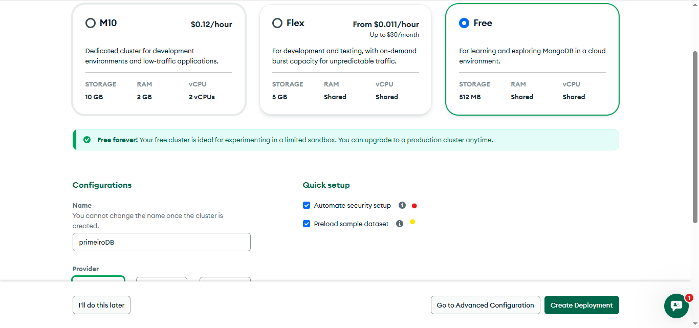  

A selção do provedor e do local do servidor eu gosto de deixar o que vem selecionado. Fique a vontade para mudar se quiser.  
Assim que tiver feito as escolhas clique em **"Create Deployment"**  

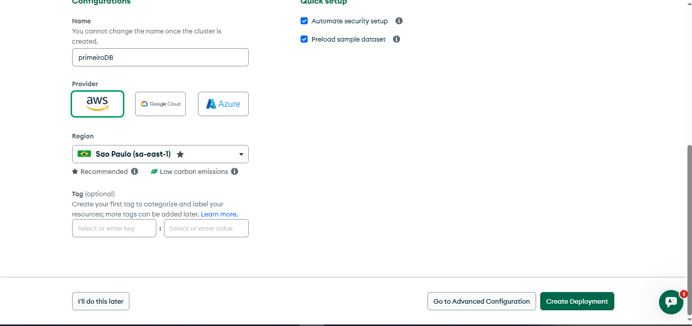  

---
### Passo 6
Em seguida o MongoDB confirmará o inicio da criação do seu banco de dados.  
Será exibido uma tela com seu usuario e senha automática (que você pode mudar nesse momento, ou mais pra frente). Nessa tela é exibido também (caso voê tenha deixado **"Automate security setup"** selecionado no passo 5 ) a informação de que seu IP foi adicionado à sua **"Access List"** (Lista de Acesso).  
Mude o usuario e a senha, se desejar, e clique em **"Create Database user"**.  
*Note que esse usuario tem os previlégios de Amin, então **não compartilhe-o com ninguem**. Você pode mudar as permissões e ou criar outro usuário depois*

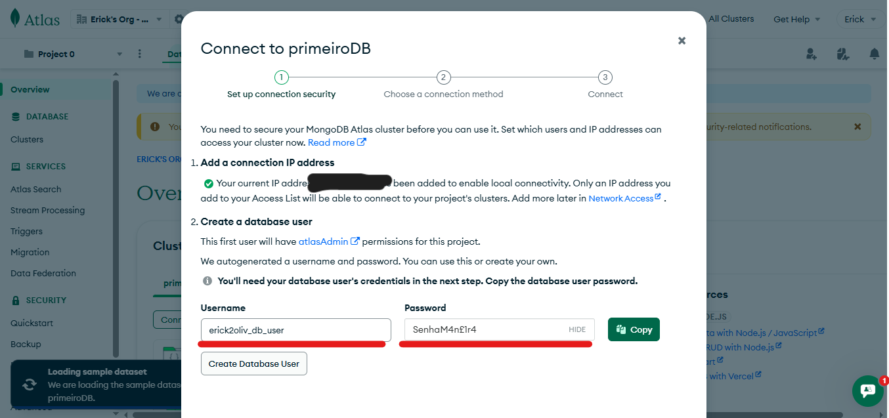  

---
### Passo 7 
Depois disso o banco de dados está sendo criado em segundo plano, e você deve escolher o método de conexão do seu banco.  
Selecione **"Drivers"** para se conectar por linha de codigo.
O TormentAPI usa Node.js então selecione no **"Driver" "Node.js" e "Version" "6.7 or Later"**  

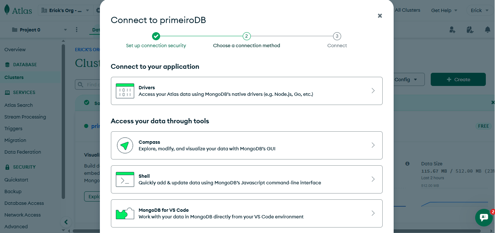  

---

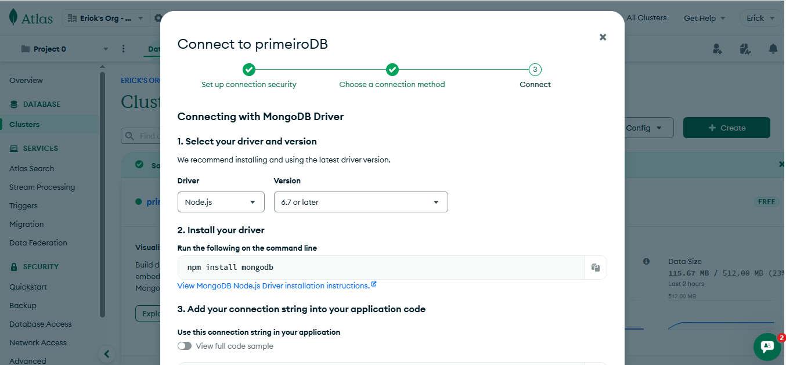   

Logo abaixo estará uma string que será nossa **"MONGODB_URI"**, copie e guarde para usarmos depois
*Lembre-se de guardar cuidadosamente essa string, pois com ela qualquer um pode ter acesso ao seu banco de dados*.  

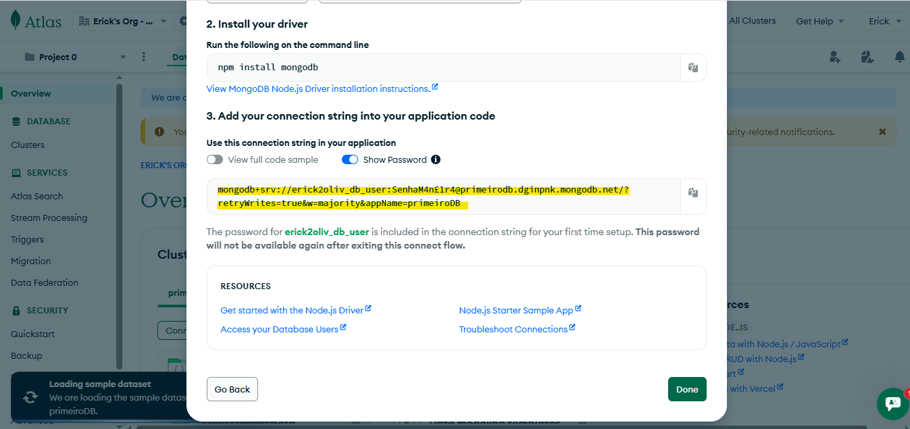 

No canto inferior esquerdo você verá o status de criação do seu banco de dados. Esse processo pode demorar ou não, dependendo se você marcou **"Preload sample dataset"** no passo 5 

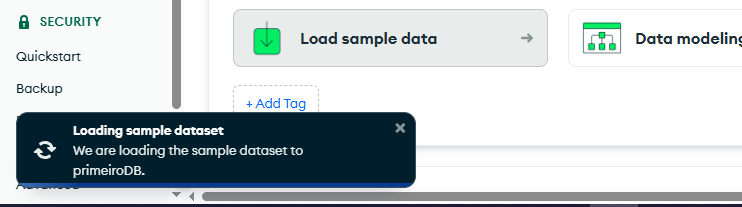 

---
### Passo 8
Vamos agora na opção **"Database Access"**, no menu lateral esquerdo.  
Aqui é o local que citei onde é possivel alterar os previlégios de um usuário, ou criar um novo para acessar o banco de dados atual.

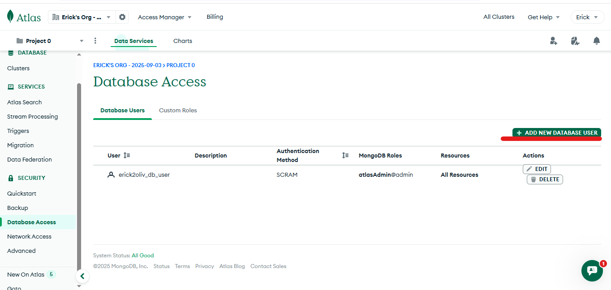  

---
### Passo 9 
E para finalizar, vamos em **"Network Access"**.
Você verá o seu IP salvo anteriormente no passo 5 e poderá cadastrar outros IP's. Esses IP's são os unicos que poderão acessar seu banco de dados.  
Para que qualquer IP tenha acesso, você pode clicar em **"+ ADD IP ADRESS"**, e no campo **"Access List Entry"** preencher com: '0.0.0.0/0'.  

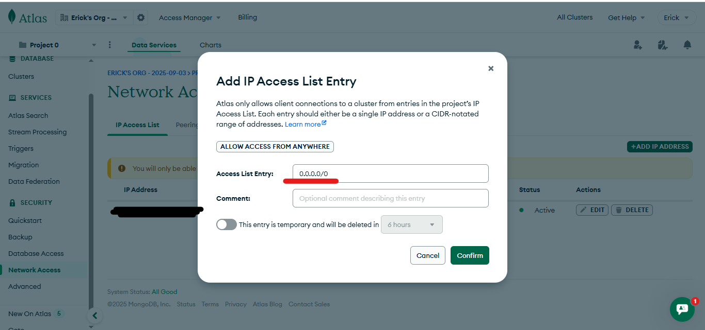 

---
### Pronto, agora você jé está com o MongoDB Atlas configurado, e pode usá-lo no TormentAPI ou em qualquer outro projeto.